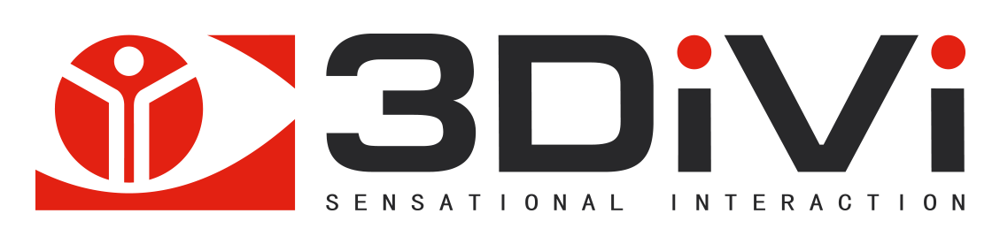

# Введение

**3DiVi Face SDK** – это набор программных компонентов (библиотек) для разработки решений по распознаванию лиц любой сложности – от простых приложений до порталов, таких как Azure Face API или AWS Rekognition.

Функции Face SDK: 
* [Детекция лиц](doc/development/face_capturing.md) – детекция и трекинг лиц на изображениях и видео 
* [Идентификация лиц](doc/development/face_identification.md) – распознавание лиц на изображениях и видео 
* [Оценка лиц](doc/development/face_estimation.md) – оценка лиц (пол, возраст, эмоции, принадлежность лица живому человеку) на изображениях и видео
* [Обработка видеопотока](doc/development/video_stream_processing.md) – детекция, трекинг и распознавание лиц на видеопотоках 

# Поддерживаемые платформы и API

В настоящий момент доступна поддержка следующих платформ и архитектур:

* Windows (x86 32-bit, x86 64-bit)
* Linux (x86 32-bit, x86 64-bit, ARM 32-bit, ARM 64-bit)
* Android (ARM 32-bit, ARM 64-bit)
* iOS (ARM 64-bit)

Face SDK включает в себя следующие API:

* C++ API (для платформ Windows, Linux, Android)
* Java-обертка (для платформ Windows, Linux, Android)
* C#-обертка (для платформ Windows, Linux)
* Objective-C-обертка (для платформы iOS)

# Начало работы с Face SDK 

* [Компоненты](doc/components.md) – важная информация о компонентах Face SDK
* [Сценарии использования](doc/use_cases.md) – схемы, показывающие возможные сценарии использования и связь между компонентами
* [Сэмплы](doc/samples) – программы на языках C++/C#/Java, демонстрирующие функции Face SDK
* [Туториалы](doc/tutorials) – пошаговые туториалы по разработке проектов с трекингом и распознаванием лиц, а также определением пола, возраста и эмоций лица
* [Лицензии](doc/licenses.md) – информация о разных типах лицензий, активации и привязке лицензий 
* [Параметры производительности](doc/performance_parameters.md) – загрузка ЦП и использование памяти, качество идентификации (FAR/FRR) 

# Пробная версия Face SDK 

Для начала работы с Face SDK загрузите бесплатную [пробную версию Face SDK](https://face.3divi.com/ru/products/face_sdk/face_sdk_trial).

Для того, чтобы снять ограничения пробной версии, приобретите *лицензию Face SDK* и *Developer Pack*, который является прекрасным инструментом для разработчиков, которые хотели бы интегрировать Face SDK в свой проект, не потратив при этом много усилий и средств. За небольшую фиксированную плату Вы получаете необходимое количество лицензий разработчика, а также доступ к расширенной технической поддержке, в том числе отдельный чат с нашими старшими программистами. В зависимости от Вашего сценария использования, Вы можете приобрести лицензии для любого набора [компонентов Face SDK](doc/components.md). 

Если у Вас есть какие-либо вопросы, напишите нам: face@3divi.com 

# Приступая к работе

После загрузки дистрибутива с триальной лицензией (см. [Пробная версия Face SDK](#пробная-версия-face-sdk)) распакуйте архив в любую директорию на вашем устройстве. Внутри распакованного архива должны находиться:
* директории: *conf, docs, examples, include, share*
* архивы: `windows_x86_64.zip`, `windows_x86_32.zip`, `linux_x86_64.tar.xz`, `linux_x86_32.tar.xz`, `linux_armhf_32.tar.xz`, `linux_aarch64.tar.xz`, `android_arm_32.tar.xz`, `android_arm_64.tar.xz`, `ios_arm_64.tar.xz`
* файл *CHANGES*

Выберите один из архивов в зависимости от используемой платформы. В пути распаковки укажите корневую папку Face SDK – распакованные папки *bin* и *lib* должны находиться на одном уровне с директориями *conf, docs, examples, include, share*.

 
<b>Путь распаковки архива - корневая папка дистрибутива Face SDK</b> 

После распаковки архива Вы можете ознакомиться с функционалом Face SDK, запустив [сэмплы](doc/samples), демонстрирующие работу с C++, Java и C# API.

# Разработка 

* [Подключение Face SDK к проекту](doc/development/connect_facesdk.md) – узнайте, как добавить библиотеку libfacerec в проект 
* [Обработка видеопотока](doc/development/video_stream_processing.md) – детекция лиц, создание шаблонов, распознавание лиц, определение пола, возраста, эмоций, кратковременная идентификация
* [Детекция лиц](doc/development/face_capturing.md) – пользовательский вариант детекции лиц, получения информации о лицах, антропометрических точках
* [Оценка лиц](doc/development/face_estimation.md) – пользовательский вариант определения пола, возраста, эмоций, принадлежности лица живому человеку (2D/3D)
* [Идентификация лиц](doc/development/face_identification.md) – пользовательский вариант идентификации лиц, методы идентификации
* [Обработка ошибок](doc/development/error_handling.md) – обработка ошибок в C++/C#/Java
* [Управление памятью](doc/development/memory_management.md) – управление памятью в C++/C#/Java
* [Рекомендации по камерам](doc/guidelines_for_cameras.md) – размещение камер и съемка, рекомендуемые характеристики камер
* [Межплатформенное Face SDK API. Последняя версия в формате Doxygen](http://download.3divi.com/facesdk/0d88ba7c-9a5d-45cd-897a-406fb1fca2d4/latest_docs/russian/annotated.html)

# Лицензии свободного ПО

* OpenSSL (https://www.openssl.org)
* Crypto++ (https://www.cryptopp.com)
* Boost (http://www.boost.org)
* OpenCV (http://opencv.org)

© Все права защищены. <a href="https://3divi.com/">3DiVi Inc.</a>

<a href="mailto: face@3divi.com">face@3divi.com</a>

