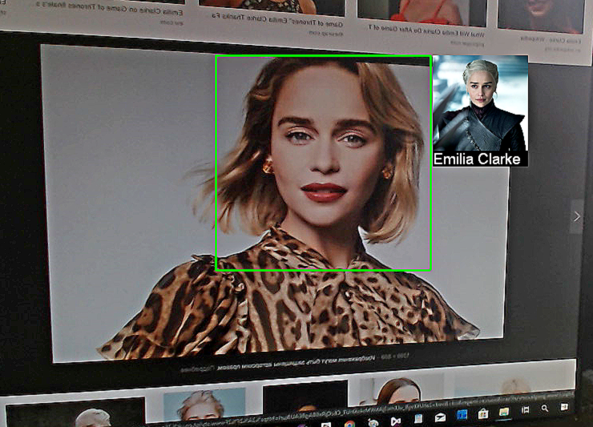

# Распознавание лиц на видеопотоке

В этом туториале Вы узнаете, как распознавать лица на видеопотоке. Для распознавания будет использоваться готовая база лиц из дистрибутива Face SDK (в базе находятся фотографии нескольких знаменитых людей). Распознанные на видеопотоке лица будут подсвечиваться зеленым прямоугольником, рядом с лицом будет отображаться фотография соответствующего человека из базы лиц и его имя. В основе данного туториала лежит туториал [Детекция и трекинг лиц на видеопотоке](face_detection_and_tracking_in_a_video_stream.md) и соответствующий проект, данный туториал является его продолжением и дополнением.

Готовый демо-проект вы можете найти в дистрибутиве Face SDK: [examples/tutorials/face_recognition_with_video_worker](../../face_recognition_with_video_worker)

<p align="center">
<br>
</p>

## Подготовка проекта

1. Поскольку в туториале [Детекция и трекинг лиц на видеопотоке](face_detection_and_tracking_in_a_video_stream.md) мы указывали только два параметра Face SDK (путь до дистрибутива Face SDK и имя конфигурационного файла для объекта `VideoWorker`), а в данном проекте их будет несколько (добавляется путь до базы лиц, имя конфигурационного файла с методом распознавания, FAR), для удобства мы модифицируем несколько файлов. Укажем все параметры в структуре `FaceSdkParameters`. В заголовочном файле `facesdkparameters.h` указываем путь до конфигурационного файла `video_worker_lbf.xml`.

**facesdkparameters.h**
```cpp
struct FaceSdkParameters
{
    ...
    std::string videoworker_config = "video_worker_lbf.xml";
};
```

2. Передадим структуру `face_sdk_parameters` в конструктор объекта `Worker`.

**viewwindow.h**
```cpp
class ViewWindow : public QWidget
{
    Q_OBJECT
    public:
        explicit ViewWindow(
            QWidget *parent,
            pbio::FacerecService::Ptr service,
            FaceSdkParameters face_sdk_parameters);
    ...
    private:
    ...
        std::shared_ptr<Worker> _worker;
        pbio::FacerecService::Ptr _service;
};
```

**viewwindow.cpp**
```cpp
ViewWindow::ViewWindow(
    QWidget *parent,
    pbio::FacerecService::Ptr service,
    FaceSdkParameters face_sdk_parameters) :
QWidget(parent),
ui(new Ui::ViewWindow),
_service(service)
{
    ui->setupUi(this);
    ...
    _worker = std::make_shared<Worker>(
        _service,
        face_sdk_parameters);
    ...
};
```

**worker.h**
```cpp
#include "qcameracapture.h"
#include "facesdkparameters.h"
...
class Worker
{
    ...
    Worker(
        const pbio::FacerecService::Ptr service,
        const FaceSdkParameters face_sdk_parameters);
    ...
};
```

**worker.cpp**
```cpp
Worker::Worker(
    const pbio::FacerecService::Ptr service,
    const FaceSdkParameters face_sdk_parameters)
{
    pbio::FacerecService::Config vwconfig(face_sdk_parameters.videoworker_config);
    ...
}
```

3. В данном проекте нас интересует исключительно детекция лица на видеопотоке (создание ограничивающего прямоугольника) и последующее распознавание. Обратите внимание, что в первом проекте (*detection_and_tracking_with_video_worker*), который Вы можете использовать для создания данного проекта, помимо ограничивающего прямоугольника также отображаются антропометрические точки и углы. При необходимости Вы можете удалить ненужную визуализацию из первого проекта.

## Создание базы лиц

1. Прежде всего нам нужно создать базу лиц. Чтобы проверить распознавание лиц, вы можете использовать готовую базу из дистрибутива Face SDK. Она включает в себя фотографии трех знаменитостей (Илон Маск, Эмилия Кларк, Лионель Месси). Для проверки распознавания вы можете скопировать готовую базу в корневую папку проекта (рядом с .pro файлом), запустить проект, открыть фотографию из базы и направить камеру на монитор. Также вы можете добавить в базу свою фотографию для распознавания. Для этого вам нужно создать папку в базе, указать ваше имя в названии и поместить в эту папку ваше фото (по аналогии с другими папками).
2. Создаем новый класс `Database` для работы с базой лиц: **Add New > C++ > C++ Class > Choose… > Class name – Database > Next > Project Management** (настройки по умолчанию) **> Finish**. В заголовочном файле `database.h` подключаем заголовочные файлы `QImage`, `QString` для работы с изображениями и строками и `libfacerec.h` для интеграции Face SDK.

**database.h**
```cpp
#include <QImage>
#include <QString>
#include <facerec/libfacerec.h>
class Database
{
    public:
    Database();
}
```

3. В файле `database.cpp` подключаем заголовочные файлы `database.h` и `videoframe.h` (реализация интерфейса `IRawImage`, через который `VideoWorker` принимает кадры). Также добавляем необходимые заголовочные файлы для работы с файловой системой, отладки, обработки исключений и работы с файлами.

**database.cpp**
```cpp
#include "database.h"
#include "videoframe.h"
#include <QDir>
#include <QDebug>
#include <stdexcept>
#include <fstream>
```

4. В заголовочном файле `database.h` добавляем конструктор, где прописываем путь до базы лиц, а также указываем объект `Recognizer` для создания шаблонов, объект `Capturer` для детекции лиц и far (вероятность того, что один человек может быть принят за другого). Вектор `vw_elements` содержит в себе элементы базы данных `VideoWorker`. Векторы `thumbnails` и `names` содержат в себе превью фотографий и имена лиц из базы.

**database.h**
```cpp
class Database
{
    public:
    ...
    // Создаем базу
    Database(
        const std::string database_dir_path,
        pbio::Recognizer::Ptr recognizer,
        pbio::Capturer::Ptr capturer,
        const float fa_r);
    std::vector<pbio::VideoWorker::DatabaseElement> vw_elements;
    std::vector<QImage> thumbnails;
    std::vector<QString> names;
}
```

5. В файле `database.cpp` добавляем реализацию конструктора `Database`, объявленного в предыдущем пункте. Величина `distance_threshold` означает порог распознавания. Поскольку для разных методов этот порог разный, мы получаем его из значения FAR с помощью метода `getROCCurvePointByFAR`.

**database.cpp**
```cpp
Database::Database(
    const std::string database_dir_path,
    pbio::Recognizer::Ptr recognizer,
    pbio::Capturer::Ptr capturer,
    const float fa_r)
{
    const float distance_threshold = recognizer->getROCCurvePointByFAR(fa_r).distance;
}
```

6. В переменной `database_dir` указываем путь до директории с базой лиц. Если путь не существует, то будет выводиться ошибка *“database directory doesn’t exist”*. Создаем переменную `person_id` для хранения id человека из базы (соотносится с папкой *“person...”*) и переменную `element_id_counter` для хранения id элемента в базе (соотносится с фотографией человека из базы). В списке `dirs` формируем список всех поддиректорий из указанной директории с базой.

**database.cpp**
```cpp
Database::Database(
    const std::string database_dir_path,
    pbio::Recognizer::Ptr recognizer,
    pbio::Capturer::Ptr capturer,
    const float fa_r)
{
    ...
    QDir database_dir(QString::fromStdString(database_dir_path));
    if (!database_dir.exists())
    {
        throw std::runtime_error(database_dir_path + ": database directory doesn't exist");
    }
    int person_id = 0;
    int element_id_counter = 0;
    QFileInfoList dirs = database_dir.entryInfoList(
        QDir::AllDirs | QDir::NoDotAndDotDot,
        QDir::DirsFirst);
}
```

_**Примечание:** Более подробную информацию о значениях FAR и TAR для разных методов распознавания см. в пункте [Характеристики идентификации](../performance_parameters.md#характеристики-идентификации)._

7. В цикле `for(const auto &dir: dirs)` обрабатываем каждую поддиректорию – данные для отдельного человека. В качестве имени человека берем название директории. Формируем список изображений в `person_files`.

**database.cpp**
```cpp
Database::Database(...)
{
    ...
    for(const auto &dir: dirs)
    {
        QDir person_dir(dir.filePath());
        QString name = dir.baseName();
        QFileInfoList person_files = person_dir.entryInfoList(QDir::Files | QDir::NoDotAndDotDot);
    }
}
```

8. Во вложенном цикле `for(const auto &person_file: person_files)` обрабатываем каждое изображение. В случае, если фото не существует, выводится предупреждение *“Can’t read image”*.

**database.cpp**
```cpp
Database::Database(...)
{
    ...
    for(const auto &dir: dirs)
    {
        ...        
        QFileInfoList person_files = person_dir.entryInfoList(QDir::Files | QDir::NoDotAndDotDot);
        
        for(const auto &person_file: person_files)
        {
            QString path = person_file.filePath();
            qDebug() << "processing" << path << "name:" << name;
            QImage image(path);
            if(image.isNull())
            {
                qDebug() << "\n\nWARNING: cant read image" << path << "\n\n";
                continue;
            }
            if (image.format() != QImage::Format_RGB888)
            {
                image = image.convertToFormat(QImage::Format_RGB888);
            }
            VideoFrame frame;
            frame.frame() = QCameraCapture::FramePtr(new QImage(image));
        }
    }
}
```

9. Детектируем лицо на фото, используя объект `Capturer`. В случае, если фото невозможно прочитать, на фото не удалось найти лицо или найдено более одного лица, выводится предупреждение и фото игнорируется.

**database.cpp**
```cpp
Database::Database(...)
{
    ...
    for(const auto &dir: dirs)
    {
        ...        
        QFileInfoList person_files = person_dir.entryInfoList(QDir::Files | QDir::NoDotAndDotDot);
        
        for(const auto &person_file: person_files)
        {
            ...
            // Детектируем лица
            const std::vector<pbio::RawSample::Ptr> captured_samples = capturer->capture(frame);
            if(captured_samples.size() != 1)
            {
                qDebug() << "\n\nWARNING: detected" << captured_samples.size() <<
                    "faces on" << path << "image instead of one, image ignored\n\n";
                continue;
            }
            const pbio::RawSample::Ptr sample = captured_samples[0];
        }
    }
}
```

10. При помощи метода `recognizer->processing` создаем шаблон лица для распознавания.

**database.cpp**
```cpp
Database::Database(...)
{
    ...
    for(const auto &dir: dirs)
    {
        ...        
        QFileInfoList person_files = person_dir.entryInfoList(QDir::Files | QDir::NoDotAndDotDot);
        
        for(const auto &person_file: person_files)
        {
            ...
            // Создаем шаблон
            const pbio::Template::Ptr templ = recognizer->processing(*sample);
        }
    }
}
```

11. В структуре `pbio::VideoWorker::DatabaseElement vw_element` указываем всю информацию об элементе базы, которая в дальнейшем будет передана для обработки объекту `VideoWorker` (уникальный идентификатор элемента, уникальный идентификатор человека, шаблон лица, порог распознавания). Используя метод `push_back`, добавляем элемент в конец списка.

**database.cpp**
```cpp
Database::Database(...)
{
    ...
    for(const auto &dir: dirs)
    {
        ...        
        QFileInfoList person_files = person_dir.entryInfoList(QDir::Files | QDir::NoDotAndDotDot);
        
        for(const auto &person_file: person_files)
        {
            ...
            // Подготавливаем данные для VideoWorker
            pbio::VideoWorker::DatabaseElement vw_element;
            vw_element.element_id = element_id_counter++;
            vw_element.person_id = person_id;
            vw_element.face_template = templ;
            vw_element.distance_threshold = distance_threshold;
            vw_elements.push_back(vw_element);
            thumbnails.push_back(makeThumbnail(image));
            names.push_back(name);
        }
        ++person_id;
    }
}
```

12. В заголовочном файле `database.h` добавляем метод `makeThumbnail` для создания превью фотографии лица из базы.

**database.cpp**
```cpp
class Database
{
    public:
        // Создаем превью из сэмпла
        static
        QImage makeThumbnail(const QImage& image);
        ...
};
```

13. В файле `database.cpp` добавляем реализацию метода, используя метод `makeThumbnail` для создания превью фотографии из базы лиц, которое будет отображаться рядом с распознанным лицом. Задаем его размер (120 пикселей) и масштабируем (при уменьшении пропорции изображения будут сохраняться).

**database.cpp**
```cpp
#include <fstream>
...
QImage Database::makeThumbnail(const QImage& image)
{
    const float thumbnail_max_side_size = 120.f;
    const float scale = thumbnail_max_side_size / std::max<int>(image.width(), image.height());
    QImage result = image.scaled(
        image.width() * scale,
        image.height() * scale,
        Qt::KeepAspectRatio,
        Qt::SmoothTransformation);
    return result;
}
```

14. В pro-файле зададим путь до базы лиц.

**face_recognition_with_video_worker.pro**
```cpp
...
DEFINES += FACE_SDK_PATH=\\\"$$FACE_SDK_PATH\\\"
DEFINES += DATABASE_PATH=\\\"$${_PRO_FILE_PWD_}/base\\\"
INCLUDEPATH += $${FACE_SDK_PATH}/include
...
```

15. В заголовочном файле **facesdkparameters.h** указываем путь до базы лиц, а также значение FAR.

**facesdkparameters.h**
```cpp
struct FaceSdkParameters
{
    ...
    std::string videoworker_config = "video_worker_lbf.xml";
    std::string database_dir = DATABASE_PATH;
    const float fa_r = 1e-5;
};
```

## Поиск лица по базе и отображение результата в консоли

1. В заголовочном файле `facesdkparameters.h` указываем путь до конфигурационного файла с методом распознавания. В данном проекте мы используем метод 6v7, потому что он подходит для обработки видеопотока и обеспечивает оптимальную скорость распознавания и хорошее качество. Более подробную информацию о рекомендуемых методах распознавания см. в пункте [Идентификация лиц](../development/face_identification.md).

**facesdkparameters.h**
```cpp
struct FaceSdkParameters
{
    ...
    std::string videoworker_config = "video_worker_lbf.xml";
    std::string database_dir = DATABASE_PATH;
    const float fa_r = 1e-5;
    std::string method_config = "method6v7_recognizer.xml";
};
```

_**Примечание:** Если вы хотите распознавать лица на видеопотоке на низкопроизводительных устройствах, вы можете использовать метод 9.30. При этом скорость распознавания будет выше, чем с методом 6.7, но качество распознавания будет ниже._

2. В заголовочном файле `worker.h` в структуре `FaceData` добавляем переменную `match_database_index`, в которой в случае совпадения лица с человеком из базы будет записан номер элемента из базы или `"-1"` в случае несовпадения. Также подключаем базу лиц `Database` и добавляем коллбэк распознавания `MatchFoundCallback`.

**worker.h**
```cpp
#include "qcameracapture.h"
#include "facesdkparameters.h"
#include "database.h"
...
class Worker
{
public:
    struct FaceData
    {
        pbio::RawSample::Ptr sample;
            bool lost;
            int frame_id;
            int match_database_index;
            FaceData() :
                lost(true),
                match_database_index(-1)
            {
            }
    };
    ...
    pbio::VideoWorker::Ptr _video_worker;
    Database _database;
    ...
    static void TrackingLostCallback(
        const pbio::VideoWorker::TrackingLostCallbackData &data,
        void* const userdata);
    static void MatchFoundCallback(
        const pbio::VideoWorker::MatchFoundCallbackData &data,
        void* const userdata);
    int _tracking_callback_id;
    int _tracking_lost_callback_id;
    int _match_found_callback_id;
};
```

3. В файле `worker.cpp` переопределяем значение параметра в конфигурационном файле, чтобы коллбэк `MatchFoundCallback` приходил в том числе и для нераспознанных лиц. Укажем параметры объекта `VideoWorker`: в первом туториале распознавание лиц не производилось, поэтому мы указывали только значение `streams_count`. Поскольку в этом проекте мы распознаем лица на видеопотоке, нам нужно указать в конструкторе путь до конфигурационного файла с методом распознавания, а также значения `processing_threads_count` (количество потоков для создания шаблонов) и `matching_threads_count` (количество потоков для сравнения шаблонов). В данном проекте используется один видеопоток (подключенная камера). Подключаем базу лиц: передаем путь до базы, создаем объект `Capturer` для детекции лиц и объект `Recognizer` для построения шаблонов, а также указываем коэффициент FAR. Используя метод `setDatabase`, задаем базу лиц для объекта `VideoWorker`. Используя метод `addMatchFoundCallback`, добавляем обработчик события распознавания `MatchFound`.

**worker.cpp**
```cpp
Worker::Worker(
    const pbio::FacerecService::Ptr service,
    const FaceSdkParameters face_sdk_parameters)
{
    pbio::FacerecService::Config vwconfig(face_sdk_parameters.videoworker_config);
   
    vwconfig.overrideParameter("not_found_match_found_callback", 1);
    _video_worker = service->createVideoWorker(
        vwconfig,
        face_sdk_parameters.method_config,
        1,   // streams_count
        1,   // processing_threads_count
        1);  // matching_threads_count
    _database = Database(
        face_sdk_parameters.database_dir,
        service->createRecognizer(face_sdk_parameters.method_config, true, false),
        service->createCapturer("common_capturer4_lbf_singleface.xml"),
        face_sdk_parameters.fa_r);
    _video_worker->setDatabase(_database.vw_elements);
    ...
    _match_found_callback_id =
        _video_worker->addMatchFoundCallbackU(
            MatchFoundCallback,
            this);
}
```

4. В деструкторе `Worker::~Worker()` удаляем коллбэк `MatchFoundCallback`.

**worker.cpp**
```cpp
Worker::~Worker()
{
    _video_worker->removeTrackingCallback(_tracking_callback_id);
    _video_worker->removeTrackingLostCallback(_tracking_lost_callback_id);
    _video_worker->removeMatchFoundCallback(_match_found_callback_id);
}
...
```

5. В коллбэке `MatchFoundCallback` результат приходит в виде структуры `MatchFoundCallbackData`, которая хранит данные о распознанных и нераспознанных лицах.

**worker.cpp**
```cpp
// static
void Worker::TrackingLostCallback(
    const pbio::VideoWorker::TrackingLostCallbackData &data,
    void* const userdata)
{
    ...
}
// static
void Worker::MatchFoundCallback(
    const pbio::VideoWorker::MatchFoundCallbackData &data,
    void* const userdata)
{
    assert(userdata);
    const pbio::RawSample::Ptr &sample = data.sample;
    const pbio::Template::Ptr &templ = data.templ;
    const std::vector<pbio::VideoWorker::SearchResult> &search_results = data.search_results;
    // Информация о пользователе - указатель на Worker
    // Передаем указатель
    Worker &worker = *reinterpret_cast<Worker*>(userdata);
    assert(sample);
    assert(templ);
    assert(!search_results.empty());
}
```

Когда для отслеживаемого лица создается шаблон, он сравнивается с каждым шаблоном из базы, и если расстояние до ближайшего элемента оказывается меньше порога distance_threshold, указанного в этом элементе, то фиксируется совпадение. В случае, если лицо на видеопотоке не распознано, выводится сообщение “Match not found”. Если лицо распознано, то в консоли выводится сообщение “Match found with...” и имя человека, с которым найдено соответствие.

worker.cpp
// static
void Worker::MatchFoundCallback(
    const pbio::VideoWorker::MatchFoundCallbackData &data,
    void* const userdata)
{
    ...    
    for(const auto &search_result: search_results)
    {
        const uint64_t element_id = search_result.element_id;
        if(element_id == pbio::VideoWorker::MATCH_NOT_FOUND_ID)
        {
            std::cout << "Match not found" << std::endl;
        }
        else
        {
            assert(element_id < worker._database.names.size());
            std::cout << "Match found with '"
                << worker._database.names[element_id].toStdString() << "'";
        }
    }
    std::cout << std::endl;
}
Сохраняем данные о распознанном лице для отрисовки превью.

worker.cpp
// static
void Worker::MatchFoundCallback(
    const pbio::VideoWorker::MatchFoundCallbackData &data,
    void* const userdata)
{
    ...
    const uint64_t element_id = search_results[0].element_id;
    if(element_id != pbio::VideoWorker::MATCH_NOT_FOUND_ID)
    {
        assert(element_id < worker._database.thumbnails.size());
        // Сохраняем результат лучшего соответствия для последующей отрисовки
        const std::lock_guard<std::mutex> guard(worker._drawing_data_mutex);
        FaceData &face = worker._drawing_data.faces[sample->getID()];
        assert(!face.lost);
        face.match_database_index = element_id;
    }
}
Запускаем проект. В консоли будут отображаться результаты распознавания. Если лицо распознано, будет отображаться id лица и имя распознанного человека из базы. Если лицо не распознано, будет отображаться сообщение “Match not found”.
fourth_1.jpeg
Отображение превью распознанного лица из базы
Для удобства восприятия добавим отображение фото и имени человека из базы рядом с лицом на видеопотоке. В файле drawfunction.h добавляем ссылку на базу лиц, поскольку она потребуется при отрисовке результатов распознавания.

drawfunction.h
#include "database.h"
class DrawFunction
{
public:
    DrawFunction();
    static QImage Draw(
        const Worker::DrawingData &data,
        const Database &database);
};
В файле drawfunction.cpp модифицируем функцию DrawFunction::Draw, передав в нее базу лиц.

drawfunction.cpp
// static
QImage DrawFunction::Draw(
    const Worker::DrawingData &data,
    const Database &database)
{
    ...
    const pbio::RawSample& sample = *face.sample;
    QPen pen;
}
Сохраняем ограничивающий прямоугольник лица в структуре pbio::RawSample::Rectangle. Передаем его параметры (x, y, ширина, высота) объекту QRect rect.

drawfunction.cpp
QImage DrawFunction::Draw(...)
{
    ...
    // Сохраняем ограничивающий прямоугольник лица
    const pbio::RawSample::Rectangle bounding_box = sample.getRectangle();
    QRect rect(bounding_box.x, bounding_box.y, bounding_box.width, bounding_box.height);
}
Создаем булеву переменную recognized, которая будет обозначать, распознано лицо или не распознано. Если лицо распознано, ограничивающий прямоугольник будет зеленого цвета, если нет – красного.

drawfunction.cpp
QImage DrawFunction::Draw(...)
{
    ...
    const bool recognized = face.match_database_index >= 0;
    const QColor color = recognized ?
        Qt::green :
        Qt::red;  // Красным выделяются нераспознанные лица
    // Отображаем ограничивающий прямоугольник лица
    {
        pen.setWidth(3);
        pen.setColor(color);
        painter.setPen(pen);
        painter.drawRect(rect);
    }
}
По номеру face.match_database_index получаем изображение из базы для превью. Рассчитываем положение превью в кадре.

drawfunction.cpp
QImage DrawFunction::Draw(...)
{
    ...
        // Отображаем фото из базы
        if (recognized)
        {
            const QImage thumbnail = database.thumbnails[face.match_database_index];
            // Рассчитываем положение превью
            QPoint preview_pos(
                rect.x() + rect.width() + pen.width(),
                rect.top());
}
Рисуем на превью изображение из базы. Создаем объект QImage face_preview, который больше по высоте, чем thumbnail на text_bar_height. В позиции (0, 0) рисуется исходное изображение превью. В результате мы получаем превью с черным прямоугольником в нижней части, в котором выводится имя человека. Зададим параметры шрифта, рассчитаем положение надписи и отобразим текст на превью.

drawfunction.cpp
QImage DrawFunction::Draw(...)
{
    ...
    // Отображаем фото из базы
    if (recognized)
    {
        ...
        const int text_bar_height = 20;
        QImage face_preview(
            QSize(thumbnail.width(), thumbnail.height() + text_bar_height),
            QImage::Format_RGB888);
        face_preview.fill(Qt::black);
        {
            const int font_size = 14;
            QPainter painter_preview(&face_preview);
            painter_preview.drawImage(QPoint(0, 0), thumbnail);
            painter_preview.setFont(QFont("Arial", font_size, QFont::Medium));
            pen.setColor(Qt::white);
            painter_preview.setPen(pen);
            painter_preview.drawText(
            QPoint(0, thumbnail.height() + text_bar_height - (text_bar_height - font_size) / 2),
            database.names[face.match_database_index]);
        }
    }
}
Отрисовываем превью face_preview на кадре, используя метод drawPixmap.

drawfunction.cpp
// static
QImage DrawFunction::Draw(...)
{
    ...
 
    // Отображаем фото из базы
    if (recognized)
    {
        ...
        QPixmap pixmap;
        pixmap.convertFromImage(face_preview);
        painter.drawPixmap(preview_pos, pixmap);
    }
}
В файл worker.h добавляем метод, возвращающий ссылку на базу лиц.

worker.h
class Worker
{
public:
    ...
    void getDataToDraw(DrawingData& data);
    const Database& getDatabase() const
    {
        return _database;
    }
};
Модифицируем вызов функции DrawFunction::Draw, передав в нее базу лиц.

viewwindow.cpp
void ViewWindow::draw()
{
    ...
    const QImage image = DrawFunction::Draw(data, _worker->getDatabase());
    ui->frame->setPixmap(QPixmap::fromImage(image));
}
Запускаем проект. Если лицо распознано, оно будет выделяться зеленым прямоугольником, и справа от него будет отображаться уменьшенная копия фото из базы и имя. Нераспознанные лица будут выделяться красным прямоугольником.
fourth_2.png
Определение принадлежности лица живому человеку (3D Liveness)
В этом туториале Вы узнаете, как определить, принадлежит ли лицо на видеопотоке реальному человеку, при помощи Face SDK и RGDB-сенсора. Для удобства мы будем называть эту функцию Liveness. Как правило, liveness-проверка используется для предотвращения злонамеренных действий с использованием фото вместо реального лица.

В Face SDK есть возможность определять принадлежность лица реальному человеку посредством анализа карты глубины, либо RGB-изображения с камеры. Первый способ наиболее точный, поэтому в данном туториале мы рассмотрим только его.

В качестве основы для данного проекта был взят туториал Распознавание лиц на видеопотоке. В данном проекте, как и в предыдущем, используется готовая база лиц для распознавания. После запуска готового проекта на экране будут отображаться цветное изображение и карта глубины, при помощи которой Вы сможете скорректировать свое положение относительно сенсора: для корректной работы liveness-детектора требуется, чтобы лицо находилось на достаточном расстоянии от сенсора, при этом качество карты глубины с сенсора должно быть приемлемым. На цветном изображении задетектированное и распознанное лицо будет выделяться зеленым прямоугольником, рядом с ним будет отображаться фото и имя из базы, а также liveness-статус REAL. В случае, если человек не распознан, liveness-статус будет REAL, но ограничивающий прямоугольник будет красным. Если перед камерой будет лицо с изображения или видео, то прямоугольник будет красным и распознавание не будет производиться, в этом случае liveness-статус будет FAKE.

Помимо Face SDK и Qt для данного проекта Вам потребуется:

RGBD-камера с поддержкой OpenNI2 или RealSense2 (например, ASUS Xtion или RealSense D415);
дистрибутив OpenNI2 или RealSense2.
Готовый демо-проект вы можете найти в дистрибутиве Face SDK: examples/tutorials/depth_liveness_in_face_recognition

fifth_1.png
Подключение библиотек OpenNI2 и RealSense2
Прежде всего, нам нужно подключить необходимые библиотеки для работы с камерой глубины. Вы можете использовать как OpenNI2-камеру (например, ASUS Xtion) так и камеру RealSense2. В зависимости от используемой камеры, Вам нужно прописать условие WITH_OPENNI2=1 или WITH_REALSENSE=1.

face_recognition_with_video_worker.pro
...
WITH_OPENNI2=1
#WITH_REALSENSE=1
isEmpty(WITH_OPENNI2): isEmpty(WITH_REALSENSE) {
    error("OpenNI2 or RealSense support should be enabled")
}
!isEmpty(WITH_OPENNI2): !isEmpty(WITH_REALSENSE) {
    error("OpenNI2 and RealSense support can't be enabled simultaneously")
}
...
[Для камер OpenNI2] Указываем путь до дистрибутива OpenNI2 и пути, по которым можно найти необходимые OpenNI2-библиотеки и заголовочные файлы.

Заметки
Для Windows необходимо выполнить установку дистрибутива и указать путь до директории установки. Для Linux достаточно указать путь до распакованного дистрибутива.
face_recognition_with_video_worker.pro
...
!isEmpty(WITH_OPENNI2){
    OpenniDistr = 
    isEmpty(OpenniDistr) {
        error("Empty path to OpenNI2 directory")
    }
    LIBS += -L$$OpenniDistr/Redist/
    win32: LIBS += -L$$OpenniDistr/Lib/
    INCLUDEPATH += = $$OpenniDistr/Include/
    LIBS += -lOpenNI2
    DEFINES += WITH_OPENNI2
}
...
[Для камер RealSense2] Указываем путь до дистрибутива RealSense2 и пути, по которым можно найти необходимые RealSense2-библиотеки и заголовочные файлы. В блоке win32 определяется битность платформы для формирования корректных путей до библиотек RealSense.

Заметки
Для Windows необходимо выполнить установку дистрибутива и указать путь до директории установки. Для Linux необходимо выполнить установку дистрибутива, как указано на сайте Intel RealSense. Пути до дистрибутива в pro-файле указывать не требуется.
face_recognition_with_video_worker.pro
...
!isEmpty(WITH_REALSENSE){
    win32 {
        RealSenseDistr = /home/stranger/depth_liveness/librealsense/install
        isEmpty(RealSenseDistr) {
            error("Empty path to RealSense directory")
    }
        contains(QMAKE_TARGET.arch, x86_64) {
            LIBS += -L$$RealSenseDistr/lib/x64
            LIBS += -L$$RealSenseDistr/bin/x64
        } else {
            LIBS += -L$$RealSenseDistr/lib/x86
            LIBS += -L$$RealSenseDistr/bin/x86
        }
        INCLUDEPATH += $$RealSenseDistr/include/
    }
    LIBS += -lrealsense2
    DEFINES += WITH_REALSENSE
}
...
Получение карты глубины через OpenNI2 API / RealSense2 API
На данном этапе нам необходимо получить кадры глубины с RGBD-камеры при помощи OpenNI2 API или RealSense2 API, в зависимости от используемой камеры. В данном проекте мы не будем подробно рассматривать получение кадров глубины. Мы используем заголовочные файлы, которые входят в состав одной из демо-программ Face SDK (video_recognition_demo). В pro-файле проекта указываем путь до папки examples/cpp/video_recognition_demo/src, которая находится в дистрибутиве Face SDK.

face_recognition_with_video_worker.pro
...
INCLUDEPATH += $$FACE_SDK_PATH/examples/cpp/video_recognition_demo/src
...
Указываем необходимые заголовочные файлы для работы с камерами OpenNI2 и RealSense2. Подробную информацию о получении кадров глубины Вы можете найти в указанных файлах (OpenniSource.h и RealSenseSource.h).

face_recognition_with_video_worker.pro
...
!isEmpty(WITH_OPENNI2){
    HEADERS += OpenniSource.h
}
else {
    HEADERS += RealSenseSource.h
}
...
Для использования математических констант определяем _USE_MATH_DEFINES (cmath подключен в файлах OpenniSource.h и RealSenseSource.h).

face_recognition_with_video_worker.pro
...
unix: LIBS += -ldl
win32: DEFINES += _USE_MATH_DEFINES
...
Подключение сенсора глубины для обработки кадров
В предыдущих проектах мы получали изображение с веб-камеры, используя объект QCameraCapture. Однако в этом проекте нам требуется получать не только цветные кадры, но и кадры глубины. Для этого создадим новый класс DepthSensorCapture: Add New > C++ > C++ Class > Choose… > Class name – DepthSensorCapture > Base class – QObject > Next > Project Management (настройки по умолчанию) > Finish.
В файле depthsensorcapture.h подключим заголовочный файл ImageAndDepthSource.h. Также подключаем QSharedPointer для работы с указателями, QThread для обработки потоков, QByteArray для работы с массивами байтов, memory и atomic для использования умных указателей и атомарных типов соответственно. В файле depthsensorcapture.cpp подключаем заголовочные файлы OpenniSource.h и RealSenseSource.h для получения кадров глубины, а также worker.h и depthsensorcapture.h. Для обработки ошибок используется assert.h, для отображения сообщения об ошибке используется QMessageBox.

depthsensorcapture.h
#include "ImageAndDepthSource.h"
#include <QSharedPointer>
#include <QThread>
#include <QByteArray>
#include <memory>
#include <atomic>
...
depthsensorcapture.cpp
#if defined(WITH_OPENNI2)
#include "OpenniSource.h"
#elif defined(WITH_REALSENSE)
#include "RealSenseSource.h"
#endif
#include "worker.h"
#include "depthsensorcapture.h"
#include <assert.h>
#include <QMessageBox>
...
Определяем RGBFramePtr – указатель на цветное изображение и DepthFramePtr – указатель на кадр глубины. Конструктор класса DepthSensorCapture принимает родительский виджет (parent), а также указатель на worker. Данные с сенсора будут приходить в бесконечном цикле. Чтобы главный поток, в котором происходит отрисовка интерфейса, не ждал завершения цикла, мы создаем отдельный поток и перемещаем в него объект DepthSensorCapture.

depthsensorcapture.h
...
class Worker;
class DepthSensorCapture : public QObject
{
    Q_OBJECT
public:
    typedef std::shared_ptr<QImage> FramePtr;
    typedef std::shared_ptr<QByteArray> DepthPtr;
    explicit DepthSensorCapture(
        QWidget* parent,
        std::shared_ptr<Worker> worker);
}
...
depthsensorcapture.cpp
...
DepthSensorCapture::DepthSensorCapture(
    QWidget* parent,
    std::shared_ptr<Worker> worker) :
_parent(parent),
_worker(worker)
{
    #if defined(WITH_OPENNI2)
        depth_source.reset(new OpenniSource());
    #else
        depth_source.reset(new RealSenseSource());
    #endif
    thread.reset(new QThread());
    this->moveToThread(thread.data());
    connect(thread.data(), &QThread::started, this, &DepthSensorCapture::frameUpdatedThread);
}
...
В методе DepthSensorCapture::start запускаем поток получения данных, в методе DepthSensorCapture::stop останавливаем его.

depthsensorcapture.h
...
class DepthSensorCapture : public QObject
{
    ...
    void start();
    void stop();
}
...
depthsensorcapture.cpp
...
void DepthSensorCapture::start()
{
    if (!thread->isRunning())
    {
        thread->start();
    }
}
void DepthSensorCapture::stop()
{
    if (thread->isRunning())
    {
        shutdown = true;
        thread->quit();
        thread->wait();
    }
}
...
В методе DepthSensorCapture::frameUpdatedThread обрабатываем новый кадр с камеры в бесконечном цикле и передаем его в Worker через addFrame. В случае возникновения ошибки появится окно с сообщением об ошибке.

depthsensorcapture.h
...
class DepthSensorCapture : public QObject
{
    ...
    signals:
        void newFrameAvailable();
    private
        void frameUpdatedThread();
    private:
        QWidget* _parent;
        std::shared_ptr<Worker> _worker;
        QSharedPointer<QThread> thread;
        QSharedPointer<ImageAndDepthSource> depth_source;
        std::atomic<bool> shutdown = {false};
};
...
depthsensorcapture.cpp
...
void DepthSensorCapture::frameUpdatedThread()
{
    while(!shutdown)
    {
        try
        {
            ImageAndDepth data;
            depth_source->get(data);
            _worker->addFrame(data);
            emit newFrameAvailable();
        }
        catch(std::exception& ex)
        {
            stop();
            QMessageBox::critical(
                _parent,
                tr("Face SDK error"),
                ex.what());
            break;
        }
    }
}
...
Объект VideoFrame должен содержать в себе RGB кадр с камеры.

depthsensorcapture.cpp
...
Database::Database(...)
{
    ...
    VideoFrame frame;
        frame.frame() = DepthSensorCapture::RGBFramePtr(new QImage(image));
    ...
}
...
В файле videoframe.h подключаем заголовочный файл depthsensorcapture.h для работы с камерой глубины.

videoframe.h
#include "depthsensorcapture.h"
...
Интефейс IRawImage позволяет получить указатель на данные изображения, его формат, высоту и ширину.

videoframe.h
...
class VideoFrame : public pbio::IRawImage
{
    public:
        VideoFrame(){}
        ...
        DepthSensorCapture::RGBFramePtr& frame();
        const DepthSensorCapture::RGBFramePtr& frame() const;
 
    private:
        DepthSensorCapture::RGBFramePtr _frame;
}
...
inline
DepthSensorCapture::RGBFramePtr& VideoFrame::frame()
{
    return _frame;
}
 
inline
const DepthSensorCapture::RGBFramePtr& VideoFrame::frame() const
{
    return _frame;
}
...
В методе runProcessing запускаем камеру, в методе stopProcessing – останавливаем.

viewwindow.h
...
class ViewWindow : public QWidget
{
    ...
    private:
    Ui::ViewWindow *ui;
    QScopedPointer<DepthSensorCapture> _camera;
    ...
}
...
viewwindow.cpp
#include "depthsensorcapture.h"
ViewWindow::ViewWindow(...)
{
    ...
    _camera.reset(new DepthSensorCapture(
    this,
    _worker));
    connect(_camera.data(), &DepthSensorCapture::newFrameAvailable, this, &ViewWindow::draw);
}
void ViewWindow::stopProcessing()
{
    if (!_running)
        return;
    _camera->stop();
    _running = false;
}
void ViewWindow::runProcessing()
{
    if (_running)
        return;
    _camera->start();
    _running = true;
}
...
В файле worker.h подключаем заголовочный файл depthsensorcapture.h. Структура SharedImageAndDepth содержит в себе указатели на RGB-кадр и кадр глубины с камеры, а также структуру pbio::DepthMapRaw с информацией о параметрах карты глубины (ширина, высота и т.д.). Указатели используются в Worker. Из-за некоторой задержки в обработке кадров определенное количество кадров будет складываться в очередь на отрисовку, поэтому для экономии памяти вместо самих кадров мы храним указатели на них.

worker.h
#include "depthsensorcapture.h"
    struct SharedImageAndDepth
    {
        DepthSensorCapture::RGBFramePtr color_image;
        DepthSensorCapture::DepthFramePtr depth_image;
        pbio::DepthMapRaw depth_options;
    };
...
В структуру DrawingData передаем SharedImageAndDepth frame - кадры для отрисовки (цветное изображение и карта глубины). В коллбэке TrackingCallback из очереди кадров извлекается изображение, соответствующее последнему полученному результату.

worker.h
...
class Worker
{
    ...
    struct DrawingData
    {
        ...       
        SharedImageAndDepth frame;
    }
    void addFrame(const ImageAndDepth& frame);
    private:
        DrawingData _drawing_data;
        std::mutex _drawing_data_mutex;
        std::queue<std::pair<int, SharedImageAndDepth> > _frames;
        ...
}
...
worker.cpp
...
void Worker::TrackingCallback(
    const pbio::VideoWorker::TrackingCallbackData &data,
    void * const userdata)
{    
    ...
    // Get the frame with frame_id
    SharedImageAndDepth frame;
    {
        ...
    }
}
void Worker::addFrame(const ImageAndDepth& data)
{
    ...
}
...
Обработка карты глубины при помощи VideoWorker
В конструкторе Worker::Worker переопределяем значения некоторых параметров объекта VideoWorker для обработки карты глубины. а именно:

depth_data_flag ("1" – включен режим работы с кадрами глубины для подтверждения liveness);
weak_tracks_in_tracking_callback (“1” – в TrackingCallback передаются все сэмплы, в том числе сэмплы с флагом weak = true).
Значение флага weak становится true в том случае, если сэмпл не прошел определенные проверки, например, если:

на лице слишком много теней (недостаточное освещение);
изображение нечеткое (размытое);
лицо находится под большим углом;
размер лица в кадре слишком маленький;
лицо не прошло liveness-проверку (взято с фото).
Более подробное описание требований к условиям освещения, размещения камер и т.д. Вы можете найти в пункте Рекомендации по камерам. Как правило, сэмплы, которые не прошли проверку, не передаются для дальнейшей обработки. Однако в данном проекте даже лица на фото (не прошедшие liveness-проверку) должны выделяться ограничивающим прямоугольником, следовательно, мы должны передавать в TrackingCallback в том числе сэмплы с флагом weak = true.

worker.cpp
...
Worker::Worker(...)
{
    ...
    vwconfig.overrideParameter("depth_data_flag", 1);
    vwconfig.overrideParameter("weak_tracks_in_tracking_callback", 1);
    ...
}
...
В файле worker.h в структуре FaceData указываем перечисление pbio::DepthLivenessEstimator - результат определения принадлежности лица живому человеку. Доступно четыре варианта определения liveness:

NOT_ENOUGH_DATA – недостаточно информации. Такая ситуация может возникнуть, если качество карты глубины неудовлетворительное, либо пользователь находится слишком близко/слишком далеко от сенсора.
REAL – лицо принадлежит реальному человеку.
FAKE – лицо было взято с фото/видео.
NOT_COMPUTED – лицо не было проверено. Такая ситуация может возникнуть, например, если кадры с сенсора не синхронизированы (цветной кадр получен, но соответствующий ему кадр глубины не найден в определенном временном диапазоне).
Результат liveness-проверки сохраняется в переменную face.liveness_status для дальнейшей отрисовки.

worker.h
...
class Worker
{
public:
    // Face data
    struct FaceData
    {
        ...
        pbio::DepthLivenessEstimator::Liveness liveness_status;
    }
    ...
}
...
worker.cpp
...
void Worker::TrackingCallback(...)
{
    ...
    {
        ...
        // Update the information
        {
            const std::lock_guard<std::mutex> guard(worker._drawing_data_mutex);
            ...
            // Samples
            for(size_t i = 0; i < samples.size(); ++i)
            {
                ...
                face.liveness_status = data.samples_depth_liveness_confirmed[i];
            }
        }
    }
    ...
}
...
В методе Worker::addFrame подаем последний кадр глубины в FaceSDK через метод VideoWorker::addDepthFrame и сохраняем его для дальнейшей отрисовки.

worker.h
...
class Worker
{
    ...
    private:
        ...
        DepthSensorCapture::DepthFramePtr _last_depth_image;
        pbio::DepthMapRaw _last_depth_options;
        ...
}
...
worker.cpp
...
void Worker::addFrame(const ImageAndDepth& data)
{
    ...
    const int stream_id = 0;
 
    SharedImageAndDepth frame;
 
    if (!data.depth_image.empty())
    {
        const pbio::DepthMapRaw& depth_options = data.make_dmr();
 
        _video_worker->addDepthFrame(
            depth_options,
            stream_id,
            data.depth_timestamp_microsec);
        _last_depth_image = std::make_shared<QByteArray>(
            (const char*)data.depth_image.data(),
            depth_options.depth_data_stride_in_bytes * depth_options.depth_map_rows);
        _last_depth_options = depth_options;
 
        frame.depth_image = _last_depth_image;
        frame.depth_options = depth_options;
    }
}
...
Подготавливаем и подаем в FaceSDK цветное изображение через метод VideoWorker::addVideoFrame. В случае, если формат полученного цветного изображения – не RGB, а BGR, порядок байтов меняется, чтобы цвета отображались корректно. Если вместе с цветным кадром не пришел кадр глубины, используется последний полученный кадр глубины. Пара из кадра глубины и цветного изображения сохраняется в очередь _frames, чтобы в коллбэке TrackingCallback найти данные, соответствующие результату обработки.

worker.cpp
...
void Worker::addFrame(const ImageAndDepth& data)
{
    ...
    if (!data.color_image.empty())
    {
        QImage image(
            (const uchar*)data.color_image.data(),
            data.color_width,
            data.color_height,
            data.color_stride_in_bytes,
            QImage::Format_RGB888);
        if (data.color_format != pbio::IRawImage::FORMAT_RGB)
        {
            image = image.rgbSwapped();
        }
 
        frame.color_image = std::make_shared<QImage>(image);
        VideoFrame video_frame;
        video_frame.frame() = frame.color_image;
        const std::lock_guard<std::mutex> guard(_frames_mutex);
        const int frame_id = _video_worker->addVideoFrame(
            video_frame,
            stream_id,
            data.image_timestamp_microsec);
        if (data.depth_image.empty())
        {
            frame.depth_image = _last_depth_image;
            frame.depth_options = _last_depth_options;
        }
        _frames.push(std::make_pair(frame_id, frame));
    }
    _video_worker->checkExceptions();
}
...
Визуализация RGB и карты глубины. Отображение информации о 3D Liveness
Модифицируем метод рисования DrawFunction::Draw в файле drawfunction.cpp. В поле frame структуры Worker::DrawingData содержатся указатели на данные цветного изображения и карты глубины, а также параметры кадра глубины (ширина, высота и др.). Для удобства обращения к этим данным заведем на них ссылки const QImage& color_image, const QByteArray& depth_array и const pbio::DepthMapRaw& depth_options. Цветное изображение и карта глубины будут отображаться на QImage result, который представляет собой своего рода “фон” и включает в себя оба изображения (цветное – сверху, карта глубины – снизу). Перед этим нам необходимо конвертировать 16-битные значения глубины в 8-битные для корректного отображения карты глубины (в серых тонах). В переменной max_depth_mm указываем максимальное расстояние от сенсора до пользователя (как правило, для RGBD-камер это 10 метров).

drawfunction.cpp
...
// static
QImage DrawFunction::Draw(
    const Worker::DrawingData &data,
    const Database &database)
{
    const QImage& color_image = *data.frame.color_image;
    const QByteArray& depth_array = *data.frame.depth_image;
    const pbio::DepthMapRaw& depth_options = data.frame.depth_options;
    QByteArray depth8_array;
    const uint16_t* depth_ptr = (const uint16_t*)depth_array.constData();
    const size_t elements_count_in_row = depth_options.depth_data_stride_in_bytes / sizeof(uint16_t);
    const size_t elements_count = depth_options.depth_map_rows * elements_count_in_row;
    const float max_depth_mm = 10000.f;
    for(size_t i = 0; i < elements_count; ++i)
    {
        const uint16_t depth_mm = depth_ptr[i] * depth_options.depth_unit_in_millimeters;
        const uint8_t depth_8bit = std::min<int>(255, depth_mm / max_depth_mm * 255 + 0.5);
        depth8_array += depth_8bit;
    }
    ...
}
...
Из сконвертированных значений формируем изображение глубины. Создаем объект result, на котором будет отображаться цветное изображение (в верхней части) и карта глубины (в нижней части). Рисуем эти изображения.

drawfunction.cpp
...
QImage DrawFunction::Draw(...)
{
    ...
    QImage depth_image(
        (const uchar*)depth8_array.constData(),
        depth_options.depth_map_cols,
        depth_options.depth_map_rows,
        elements_count_in_row,
        QImage::Format_Grayscale8);
    QImage result(
        QSize(std::max<int>(color_image.width(), depth_image.width()),
            color_image.height() + depth_image.height()),
        QImage::Format_RGB888);
    QPainter painter(&result);
    painter.drawImage(QPoint(0, 0), color_image);
    painter.drawImage(QPoint(0, color_image.height()), depth_image);
    ...
}
...
Отображаем liveness-статус рядом с лицом, в зависимости от информации, полученной от liveness-детектора. Зададим параметры надписи (цвет, линия, размер). На карте глубины будет отображаться ограничивающий прямоугольник, чтобы Вы могли убедиться, что кадр глубины не смещен относительно цветного кадра.

drawfunction.cpp
...
QImage DrawFunction::Draw(...)
{
    ...
    for(const auto &face_data : faces_data)
    {
        ...
        if(face.frame_id == data.frame_id && !face.lost)
        {
            ...
            // Draw the bounding box
            pen.setWidth(3);
            pen.setColor(color);
            painter.setPen(pen);
            painter.drawRect(rect);
            if (!depth_image.size().isEmpty())
            {
                const QRect rect_on_depth(
                bounding_box.x, bounding_box.y + color_image.height(),
bounding_box.width, bounding_box.height);
                painter.drawRect(rect_on_depth);
                QString liveness_str = "Liveness status: ";
                switch(face.liveness_status)
                {
                    case pbio::DepthLivenessEstimator::NOT_ENOUGH_DATA:
                        liveness_str += "NOT ENOUGH DATA";
                        break;
                    case pbio::DepthLivenessEstimator::REAL:
                        liveness_str += "REAL";
                        break;
                    case pbio::DepthLivenessEstimator::FAKE:
                        liveness_str += "FAKE";
                        break;
                    default:
                        liveness_str += "NOT COMPUTED";
                }
                const int font_size = 12;
                painter.setFont(QFont("Arial", font_size, QFont::Medium));
                pen.setColor(Qt::black);
                painter.setPen(pen);
                painter.drawText(rect.topLeft() + QPoint(1, -pen.width()), liveness_str);
                pen.setColor(Qt::white);
                painter.setPen(pen);
                painter.drawText(rect.topLeft() + QPoint(0, -pen.width()), liveness_str);
            }
            ...
        }
        ...
    }
    ...
}
...
Запускаем проект. На экране будут отображаться цветное изображение с камеры и карта глубины. На цветном изображении будет отображаться информация о найденном лице:

статус распознавания (цвет ограничивающего прямоугольника: зеленый - пользователь есть в базе, красный - нет в базе/лицо с изображения или видео);
информация о распознанном пользователе (его фотография из базы и имя);
liveness-статус: real - реальный человек, fake - лицо взято с фото или видео, not_enough_data - качество карты глубины неудовлетворительное/пользователь слишком близко или далеко от сенсора, not_computed - рассинхронизация кадра глубины и цветного кадра.
fifth_1.png
